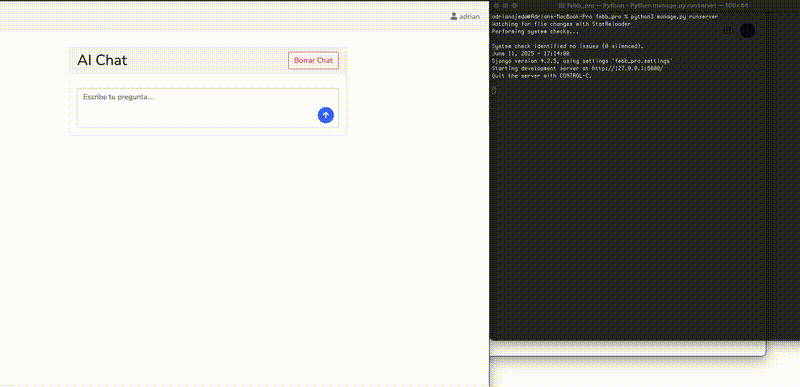

# 👋 Hi, I'm Adrian Ojeda

🚀 **Backend Developer | AI Explorer | AWS Enthusiast**

I'm a passionate backend engineer with **12+ years of experience**, specializing in:

- **Node.js (TypeScript)**
- **Java (Spring Boot)**
- **Python (Django, FastAPI, LangChain, LangGraph)**  
- **Cloud (AWS: Lambda, Step Functions, S3, DynamoDB, etc.)**  
- **SQL & NoSQL Databases**  
- **REST API Design & Development**  
- **Hexagonal Architecture & Domain-Driven Design (DDD)**  
- **AI Integration (LangChain, LangGraph, LangSmith)**  

---

## 🧠 AI + Backend

I have extensive experience designing **REST APIs**, implementing **hexagonal architectures**, applying **DDD principles**, and building **serverless workflows** with **AWS Lambda** and **Step Functions**.

I’m currently building AI-powered tools that combine the reasoning of large language models with structured data in PostgreSQL, creating **LLM-based chat systems** with real-time database access.

> ✅ **Completed:** AI chat assistant for generating **custom reports** from database records.  
> ✅ **Next:** Building a **home professional hiring assistant for hand.com.py**, leveraging **memory, reasoning, and tools** to guide users through the correct hiring process while ensuring accurate professional recommendations.  

---

## 🏢 Companies I've Collaborated With

- **Strava** 🏃
- **SoulCycle** 🚴
- **TMRW Life Sciences**
- **Progress Residential**

---

## 🌟 Projects I'm Proud Of

### 🛠️ [hand.com.py](https://hand.com.py)
Co-founder of a platform that connects home professionals with users for services across Paraguay.

✅ Currently building an **AI-powered assistant** to help users hire professionals, using **memory, reasoning, and tool-based workflows** to follow the correct process.

---

### 🏀 [ProdeBasquet System](https://sistema.prodebasquet.com/)
A web application built for a foundation that teaches basketball to children from low-income families.

✅ Includes an **AI chat** that connects an **LLM to a PostgreSQL database** to answer user queries with a mix of real data and general knowledge.  
> What’s next? I’m integrating **RAG (Retrieval-Augmented Generation)** to analyze **attached documents** like medical and psychology reports — all powered by LLMs.

📸 

---

🎥 AI Chat Demo

---

## 🛠️ Tech Stack

---

## 🤝 Connect With Me

